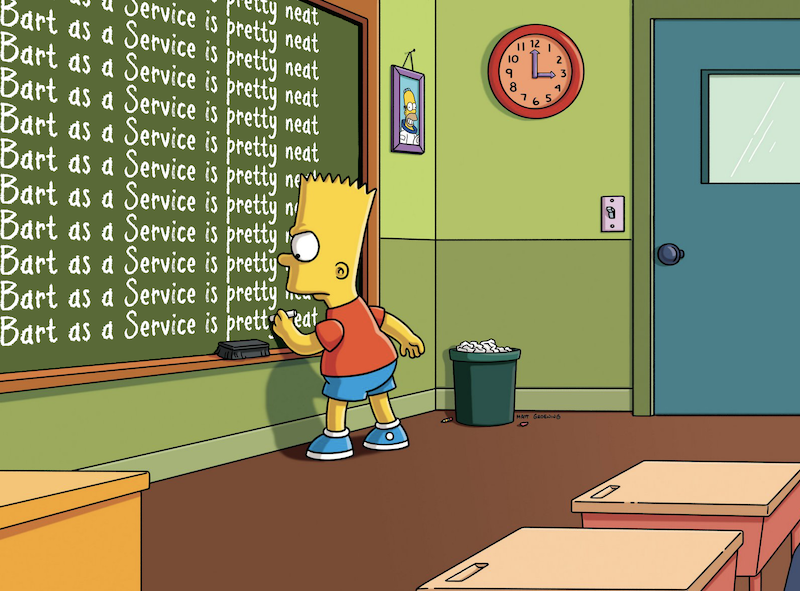

# Bart's Chalkboard
or **"Bart as a Service"** is a service that provides an HTML rendering of text you type onto Bart's chalkboard.

## Usage
 * https://bart.olore.net?s=YOUR_MESSAGE 
 * The browser will convert spaces to `%20` but don't worry, that is expected
 * Using this URL, the service returns an HTML page. So it's less of a service and more of a old school CGI
 * This is easy to type into your browser and share with your friends!

## Slack
 * My real goal in creating this was to make a Slack app so that someone could type `/bart some message` and it would drop the image with "some message" on the chalkboard into your Slack channel (kinda like a simpler `/giphy`)
 * It's functional, albeit a bit of a Rube Goldberg machine.
   * Slack POSTs the message (and other stuff) to this service
   * The service fires up Chrome via [puppeteer](https://github.com/puppeteer/puppeteer/) and calls the `?s=YOUR_MESSAGE` url from above
   * It then takes a screenshot and saves it to disk
   * Finally it response to the Slack message with the URL to the generated image

You can host this yourself and run it for your Slack workspace, as I am currently doing. I think trying to publish it into the official Slack App directory will raise copyright questions, so I am not planning on hosting it for the world.

## Thanks
* Inspiration: http://www.ranzey.com/generators/bart/index.html (Seriously check this out!)
* Font: https://www.fontspace.com/pencilpete-font-f8223
* Tooling: https://github.com/janl/mustache.js/